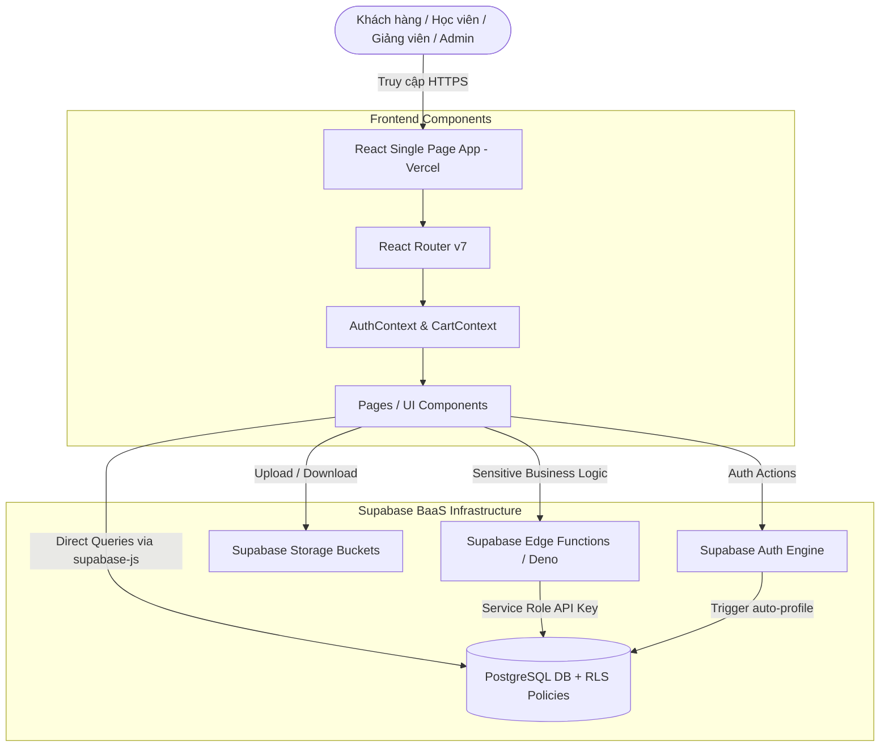

# 📚 LMS & Online Course Marketplace 
> **Hệ thống LMS tích hợp Marketplace bán khóa học trực tuyến** xây dựng theo kiến trúc hiện đại **Serverless BaaS (Backend-as-a-Service)** kết hợp **React (Vite)**, **Supabase (PostgreSQL, Auth, Storage, Edge Functions, RLS)** và hosted trên **Vercel**.

---

## 🌟 Giới thiệu tổng quan (Project Overview)

Dự án **LMS + Marketplace** được thiết kế nhằm giải quyết nhu cầu học tập và thương mại hóa tri thức direct-to-consumer (tương tự mô hình Udemy thu nhỏ). Hệ thống cung cấp nền tảng toàn diện hỗ trợ 3 nhóm người dùng chính:
- **Giảng viên (Teacher):** Dễ dàng tạo khóa học, quản lý bài học (video/text), bài tập, lớp học trực tiếp, quiz trắc nghiệm và chấm điểm học viên.
- **Học viên (Student):** Tìm kiếm khóa học, mua hàng qua giỏ hàng an toàn, học bài tương tác, theo dõi tiến độ %, làm trắc nghiệm, nộp bài tập và nhận đánh giá.
- **Quản trị viên (Admin):** Quản lý người dùng, duyệt/từ chối khóa học công khai, xem thống kê dashboard tổng quan và vận hành nền tảng.

---

## 🛠️ Công nghệ & Hạ tầng (Tech Stack & Architecture)

### 💻 Frontend
- **Framework:** [React 19](https://react.dev/) (xây dựng bằng [Vite](https://vitejs.dev/))
- **Routing:** [React Router v7](https://reactrouter.com/)
- **Styling:** [TailwindCSS v4](https://tailwindcss.com/) (giao diện hiện đại, responsive mobile/desktop)
- **Data Validation & Sanitization:** [Zod](https://zod.dev/) & [DOMPurify](https://github.com/cure53/DOMPurify)
- **State Management:** React Context API (`AuthContext`, `CartContext`)

### ⚡ Backend & Cloud Infrastructure (BaaS)
- **Database:** [Supabase PostgreSQL](https://supabase.com/) với tính năng Phân quyền tầng dữ liệu (**Row Level Security - RLS**)
- **Authentication:** Supabase Auth (JWT, tích hợp sẵn OAuth & Session management)
- **File Storage:** Supabase Storage Bucket (Lưu trữ ảnh đại diện, thumbnail khóa học, bài nộp PDF/DOCX)
- **Edge Serverless Logic:** Supabase Edge Functions (Deno / TypeScript - xử lý thanh toán atomic, quản trị user nâng cao)
- **Hosting:** Frontend trên **Vercel**, Database & Microservices trên **Supabase Cloud**

---

## 🏗️ Kiến trúc Hệ thống (System Architecture)



### 🎯 Điểm nổi bật trong kiến trúc:
1. **Không sử dụng monolithic backend controller/service cũ:** Toàn bộ truy vấn thông thường được React gọi trực tiếp tới Supabase client qua `@supabase/supabase-js`.
2. **Bảo mật tuyệt đối qua RLS:** Dữ liệu được bảo vệ nghiêm ngặt bằng **Postgres Row Level Security**. Client dùng `anon_key` công khai không thể đọc hoặc sửa trái phép dữ liệu ngoài quyền hạn được gán.
3. **Thanh toán atomic an toàn:** Các giao dịch nhạy cảm (như Checkout tạo đơn hàng & tự động cấp quyền truy cập khóa học `enrollments`) được xử lý hoàn toàn trong serverless Edge Function để chống gian lận chỉnh sửa giá từ client.

---

## 👥 Phân quyền & Luồng người dùng (Roles & Workflows)

### 🎓 1. Học viên (Student)
1. **Đăng ký & Đăng nhập:** Hệ thống tự động tạo hồ sơ `profiles` (vai trò mặc định `student`).
2. **Khám phá Khóa học:** Tìm kiếm, lọc theo danh mục các khóa học đã được duyệt (`approved`).
3. **Giỏ hàng & Checkout:** Thêm khóa học vào giỏ hàng, thực hiện thanh toán an toàn.
4. **Học tập tương tác:** Xem video học tập, đánh dấu bài học hoàn thành, theo dõi tiến độ % học tập real-time.
5. **Thi & Nộp bài:** Làm bài quiz trắc nghiệm, nộp file bài tập (`submissions`) và theo dõi kết quả/phản hồi từ giảng viên.
6. **Đánh giá:** Để lại bình luận và chấm điểm (1–5 sao) cho khóa học đã sở hữu.

### 👨‍🏫 2. Giảng viên (Teacher)
1. **Quản lý Khóa học:** Tạo khóa học mới (trạng thái mặc định `pending` chờ Admin duyệt), tải lên ảnh thumbnail.
2. **Xây dựng Bài học:** Thêm danh sách bài học (Video link YouTube unlisted hoặc Rich Text).
3. **Tạo Lớp & Bài tập:** Tạo các lớp học trực tiếp, lịch trình, bài tập nộp file và bộ đề quiz.
4. **Chấm điểm:** Xem danh sách bài nộp của học viên trong các khóa học do mình giảng dạy, nhập điểm số (`grade`) và nhận xét (`feedback`).

### 👑 3. Quản trị viên (Admin)
1. **Quản lý Người dùng:** Danh sách người dùng, thay đổi vai trò hoặc khóa/mở tài khoản an toàn (qua Edge Function `admin-users`).
2. **Duyệt Khóa học:** Xem xét các khóa học mới tạo và thay đổi trạng thái (`approved` / `rejected`).
3. **Dashboard Báo cáo:** Theo dõi các chỉ số doanh thu, tổng số học viên, số lượng khóa học trên hệ thống.

---

## 🗄️ Cấu trúc Cơ sở dữ liệu (Database Schema)

Dự án sử dụng cơ sở dữ liệu PostgreSQL chuẩn hóa cao được chia theo các bảng chính:

- `profiles`: Lưu thông tin tài khoản (kết nối 1-1 với `auth.users`, chứa `role`: `student`/`teacher`/`admin`, status `active`/`banned`).
- `categories`: Danh mục ngành học/lĩnh vực.
- `courses`: Thông tin khóa học (giá, tiêu đề, giảng viên `teacher_id`, danh mục, trạng thái duyệt `pending`/`approved`/`rejected`).
- `lessons`: Bài học từng khóa học (nội dung text hoặc link video YouTube, thứ tự `order_index`).
- `lesson_progress`: Ghi nhận các bài học mà học viên đã hoàn thành (unique `user_id`, `lesson_id`).
- `enrollments`: Bản ghi xác nhận học viên đã mua/sở hữu khóa học.
- `orders` & `order_items`: Lưu đơn hàng mua khóa học, trạng thái thanh toán và chi tiết giá giao dịch.
- `assignments` & `submissions`: Quản lý đề bài tập và bài làm nộp file kèm điểm số/phản hồi.
- `reviews`: Đánh giá 1-5 sao và nhận xét khóa học từ học viên.
- `classes`, `schedules`, `notifications`: Quản lý lớp học trực tiếp, thời khóa biểu và thông báo trong ứng dụng.
- `quizzes`, `quiz_questions`, `quiz_attempts`: Động cơ thi trắc nghiệm và chấm điểm tự động.

---

## 📁 Cấu trúc Thư mục Dự án (Folder Structure)

```text
06-project/web/
├── frontend/                     # Mã nguồn ứng dụng React Client
│   ├── src/
│   │   ├── components/           # Component UI tái sử dụng (Navbar, Sidebar, CourseCard, Toast...)
│   │   ├── context/              # Context quản lý State toàn cục (AuthContext, CartContext)
│   │   ├── hooks/                # Custom React Hooks (useAuth, useFetch...)
│   │   ├── lib/                  # Khởi tạo Supabase client (supabaseClient.js)
│   │   ├── pages/                # Các trang theo Module
│   │   │   ├── admin/            # Dashboard, Duyệt khóa học, Quản lý người dùng
│   │   │   ├── auth/             # Login, Register
│   │   │   ├── student/          # Danh sách khóa học, Chi tiết, Giỏ hàng, Học tập, Nộp bài
│   │   │   └── teacher/          # Quản lý khóa học, bài học, Lớp học, Chấm điểm bài tập
│   │   ├── services/             # Lớp giao tiếp API Supabase & Edge Functions
│   │   ├── App.jsx               # Khai báo Router & Phân quyền Frontend
│   │   └── main.jsx              # App Entrypoint
│   ├── .env.local                # Cấu hình biến môi trường (VITE_SUPABASE_URL, VITE_SUPABASE_ANON_KEY)
│   ├── package.json              # Khai báo thư viện & kịch bản chạy
│   └── tailwind.config.js        # Cấu hình TailwindCSS
├── supabase/                     # Quản lý Backend Database & Serverless Edge Functions
│   ├── functions/                # Deno Serverless Functions
│   │   └── admin-users/          # Edge Function quản trị user bằng Service Role
│   └── migrations/               # Các bản ghi chuyển đổi Schema DB PostgreSQL
│       ├── 20260620000000_initial_schema.sql
│       ├── 20260621_classes.sql
│       ├── 20260621_quiz_engine.sql
│       ├── 20260621_schedules_notifications.sql
│       └── 20260709000000_backend_security_fixes.sql
└── README.md                     # Hướng dẫn chi tiết dự án (File này)
```

---

## 🛠️ Hướng dẫn Cài đặt & Chạy ứng dụng (Setup & Running Locally)

### 📋 Yêu cầu tiên quyết (Prerequisites)
- [Node.js](https://nodejs.org/) (phiên bản 18 trở lên)
- Tải khoản [Supabase](https://supabase.com/) miễn phí
- Supabase CLI (tùy chọn nếu muốn push migration qua command line)

---

### 1️⃣ Thiết lập Backend Supabase

1. Tạo một **Project mới** trên [Supabase Dashboard](https://database.new).
2. Chạy các file migration trong thư mục `supabase/migrations/` theo thứ tự thời gian trên **SQL Editor** của Supabase Dashboard (hoặc sử dụng Supabase CLI `supabase db push`):
   - `20260620000000_initial_schema.sql`
   - `20260621_classes.sql`
   - `20260621_quiz_engine.sql`
   - `20260621_schedules_notifications.sql`
   - `20260709000000_backend_security_fixes.sql`
3. Cấu hình **Supabase Storage Bucket**:
   - Tạo public bucket tên `thumbnails` để chứa ảnh bìa khóa học.
   - Tạo private/authenticated bucket tên `submissions` để chứa file bài nộp.
4. Deploy Edge Function `admin-users` (nếu dùng quản trị nâng cao):
   ```bash
   supabase functions deploy admin-users
   ```

---

### 2️⃣ Thiết lập Frontend (React)

1. Cài đặt các thư viện phụ thuộc:
   ```bash
   cd frontend
   npm install
   ```

2. Tạo file `.env.local` tại thư mục `/frontend` với các thông số kết nối Supabase:
   ```env
   VITE_SUPABASE_URL=https://your-project-ref.supabase.co
   VITE_SUPABASE_ANON_KEY=your-supabase-anon-key
   ```

3. Khởi chạy Server phát triển (Development Server):
   ```bash
   npm run dev
   ```
   Ứng dụng sẽ chạy tại địa chỉ: `http://localhost:5173`

---

## 🔒 Bảo mật & Các quy tắc an toàn (Security & Best Practices)

- **RLS Enforced:** Mọi bảng trong Postgres đều kích hoạt `ALTER TABLE ... ENABLE ROW LEVEL SECURITY;` ngăn chặn hoàn toàn việc bypass API từ client.
- **Strict Cart & Price Verification:** Giá tiền giao dịch luôn được truy xuất và kiểm tra lại trực tiếp trong Database ở thời điểm thanh toán để phòng tránh hành vi sửa đổi giá ở phía Frontend.
- **Clean Input Data:** Tích hợp `DOMPurify` để khử trùng nội dung nhập vào tránh các lỗ hổng Cross-Site Scripting (XSS).
- **Service Role Isolation:** `service_role` API key có quyền tối thượng duy nhất chỉ được sử dụng ở môi trường bảo mật của Edge Functions, tuyệt đối không lộ ra Frontend bundle.

---

## 📄 Tài liệu liên quan (Project References)

---
*Dự án phát triển bởi **Đức Thành** *
